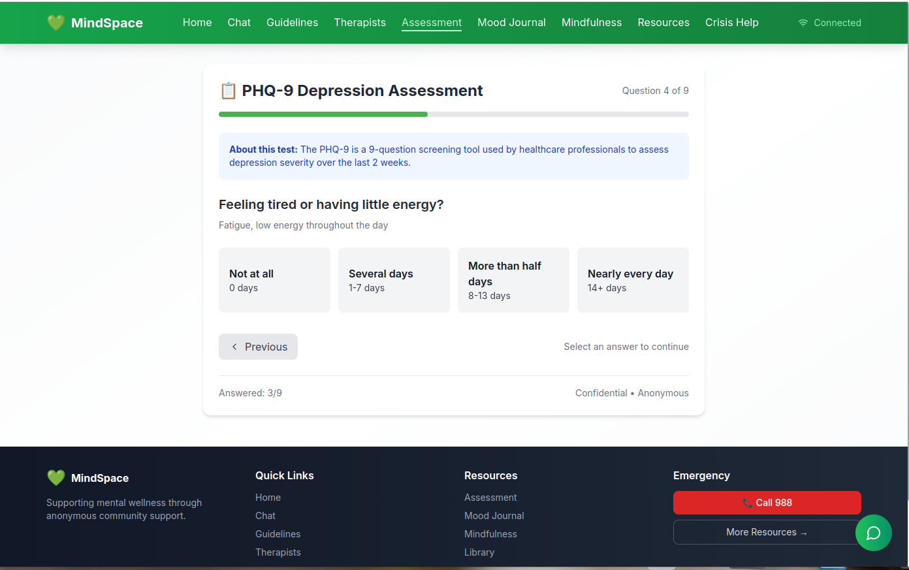

# 💚 MindSpace - Mental Health Support Platform


[](https://opensource.org/licenses/MIT)
[](https://nextjs.org/)
[](https://nodejs.org/)
[](https://mongodb.com/)
[](https://socket.io/)
[](http://makeapullrequest.com)


*Figure 1: chat 


*Figure 2: mood


*Figure 3: assessment


## 📋 Table of Contents

- [About The Project](#about-the-project)
- [Features](#features)
- [Tech Stack](#tech-stack)
- [Architecture](#architecture)
- [Getting Started](#getting-started)
- [API Documentation](#api-documentation)
- [Testing](#testing)
- [Deployment](#deployment)
- [Contributing](#contributing)
- [License](#license)
- [Contact](#contact)

---

## 📖 About The Project

**MindSpace** is a full-stack mental health support platform that provides anonymous access to mental health resources, peer support, and professional help. Built with privacy and accessibility in mind, MindSpace helps users track their mood, connect with others anonymously, and find professional help when needed.

### Why I Built This

Mental health struggles affect millions of people, but many hesitate to seek help due to stigma, cost, or privacy concerns. MindSpace addresses these barriers by providing:

- **Complete anonymity** - No personal information required
- **Free access** - All core features are free
- **24/7 availability** - Support whenever you need it
- **Professional resources** - Clinically validated tools

---

## ✨ Features

### Core Features

| Feature | Description | Status |
|---------|-------------|--------|
| 💬 **Anonymous Chat** | Real-time support chat with complete anonymity | ✅ Live |
| 📔 **Mood Journal** | Track daily moods with analytics and insights | ✅ Live |
| 📋 **PHQ-9 Assessment** | Clinically validated depression screening | ✅ Live |
| 🧘 **Mindfulness Tools** | Breathing exercises, meditation timer, grounding techniques | ✅ Live |
| 👨‍⚕️ **Therapist Directory** | Find licensed mental health professionals | ✅ Live |
| 🆘 **Crisis Resources** | One-click access to emergency support | ✅ Live |
| 📚 **Resource Library** | Articles, videos, and guides | ✅ Live |
| 📊 **Analytics Dashboard** | Visual insights into mood patterns | ✅ Live |
| 🔔 **Daily Reminders** | Push notifications for check-ins | Coming Soon |
| 🤖 **AI Support** | GPT-powered chat assistance | Coming Soon |

### Technical Features

- ✅ Real-time WebSocket communication
- ✅ RESTful API with rate limiting
- ✅ MongoDB Atlas cloud database
- ✅ JWT authentication (optional)
- ✅ Production security middleware
- ✅ Comprehensive error handling
- ✅ Input validation & sanitization
- ✅ CORS configuration
- ✅ Compression for faster responses
- ✅ PWA support for mobile installation

---

## 🛠️ Tech Stack

### Frontend

```bash
├── Next.js 14 (App Router)
├── TypeScript
├── Tailwind CSS
├── Socket.io Client
├── Chart.js
├── Lucide React Icons
└── React Hook Form
```

```bash
### Backend
├── Node.js + Express
├── MongoDB + Mongoose
├── Socket.io
├── JWT (optional auth)
├── Helmet (security)
├── CORS
├── Rate Limiting
├── Compression
├── Winston (logging)
└── Morgan (HTTP logging)
```

```bash
### DevOps & Tools
├── Git & GitHub
├── MongoDB Atlas
├── Vercel (frontend)
├── Render (backend)
├── Cypress (testing)
└── Postman (API testing)
```
## 🚀 Getting Started

### Prerequisites

- Node.js (v18 or higher)
- npm or yarn
- MongoDB Atlas account (or local MongoDB)

### Installation

#### 1. Clone the repository

```bash
git clone https://github.com/Bethelhem-Yirga/Mental-Health-Support.git
cd Mental
```

#### 2. Install Backend Dependencies

```bash
cd backend
npm install
```

#### 3. Install Frontend Dependencies

```bash
cd ../frontend-next
npm install
```

#### 4. Set up Environment Variables
#### Backend (.env):

```bash
PORT=5000
NODE_ENV=development
FRONTEND_URL=http://localhost:3000

# MongoDB
MONGODB_URI=your_mongodb_connection_string

# JWT (optional)
JWT_SECRET=your_jwt_secret
JWT_REFRESH_SECRET=your_refresh_secret

# Rate Limiting
RATE_LIMIT_WINDOW_MS=900000
RATE_LIMIT_MAX_REQUESTS=100

# Logging
LOG_LEVEL=debug
```

#### Frontend (.env.local):

```bash
NEXT_PUBLIC_API_URL=http://localhost:5000/api
NEXT_PUBLIC_SOCKET_URL=http://localhost:5000
```

#### 5. Seed the Database

```bash
cd backend
npm run seed
```

#### 6. Run the Application

```bash
# Terminal 1: Backend
cd backend
npm run dev

# Terminal 2: Frontend
cd frontend-next
npm run dev
```

#### 7. Open your browser

```bash
http://localhost:3000
```

### 📡 API Documentation
#### Base URL

```bash
Development: http://localhost:5000/api
Production: https://yourdomain.com/api
```
#### Example Request

```bash
# Create a user
curl -X POST http://localhost:5000/api/users/create

# Add mood entry
curl -X POST http://localhost:5000/api/moods/entry \
  -H "Content-Type: application/json" \
  -d '{
    "userId": "USER_ID",
    "moodValue": 2,
    "moodLabel": "😐 Okay",
    "note": "Feeling balanced"
  }'

# Submit assessment
curl -X POST http://localhost:5000/api/assessment/submit \
  -H "Content-Type: application/json" \
  -d '{
    "userId": "USER_ID",
    "answers": [1,2,1,0,1,2,1,0,1]
  }'
```

📁 Project Structure
```bash
mindspace/
├── backend/
│   ├── config/           # Configuration files
│   ├── controllers/      # Business logic
│   ├── middleware/       # Custom middleware
│   ├── models/          # MongoDB schemas
│   ├── routes/          # API routes
│   ├── scripts/         # Utility scripts
│   ├── services/        # External services
│   ├── utils/           # Helper functions
│   ├── app.js           # Express app
│   ├── server.js        # Entry point
│   └── .env             # Environment variables
│
├── frontend-next/
│   ├── app/             # Next.js app router
│   │   ├── page.tsx     # Homepage
│   │   ├── chat/        # Chat page
│   │   ├── journal/     # Mood journal
│   │   ├── assessment/  # PHQ-9 test
│   │   ├── therapists/  # Directory
│   │   ├── mindfulness/ # Tools
│   │   ├── resources/   # Library
│   │   └── crisis/      # Emergency
│   ├── components/      # React components
│   ├── contexts/        # React contexts
│   ├── hooks/           # Custom hooks
│   ├── utils/           # Utilities
│   ├── public/          # Static assets
│   ├── cypress/         # E2E tests
│   └── .env.local       # Environment variables
│
└── README.md
```

### 🤝 Contributing
Contributions are welcome! Please follow these steps:

Fork the repository

Create your feature branch (git checkout -b feature/AmazingFeature)

Commit your changes (git commit -m 'Add some AmazingFeature')

Push to the branch (git push origin feature/AmazingFeature)

Open a Pull Request

### Development Guidelines
Follow existing code style

Write tests for new features

Update documentation

Test before submitting PR

### 📄 License
Distributed under the MIT License. See LICENSE for more information.

### 📧 Contact
Your Name - @yourtwitter - your.email@example.com

Project Link: https://github.com/yourusername/mindspace

Live Demo: https://mindspace.vercel.app

### 🙏 Acknowledgments
Next.js Documentation

Socket.io Documentation

MongoDB University

Tailwind CSS

PHQ-9 Depression Scale

### ⭐ Show Your Support
If this project helped you, please give it a ⭐ on GitHub!

